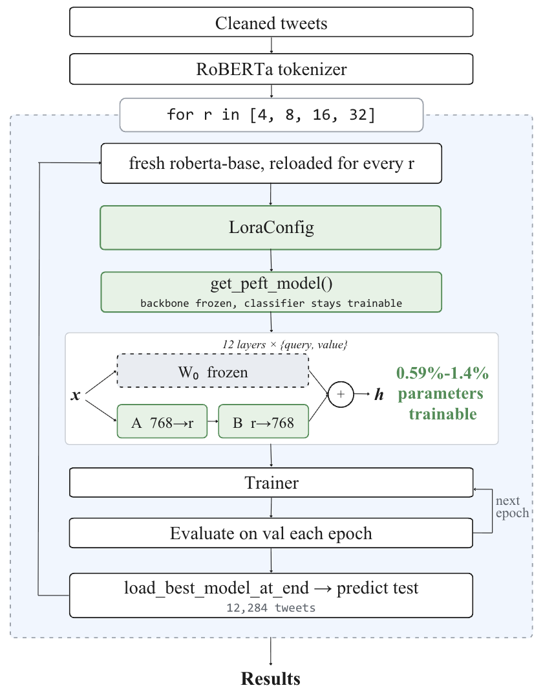
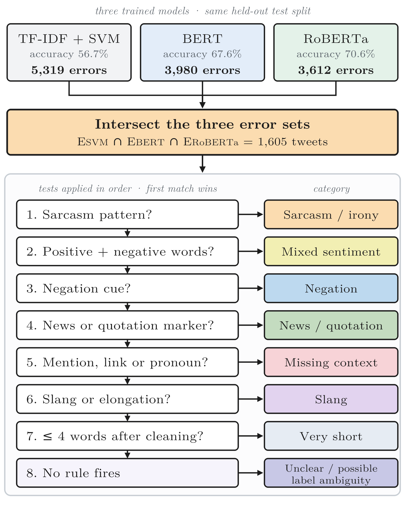
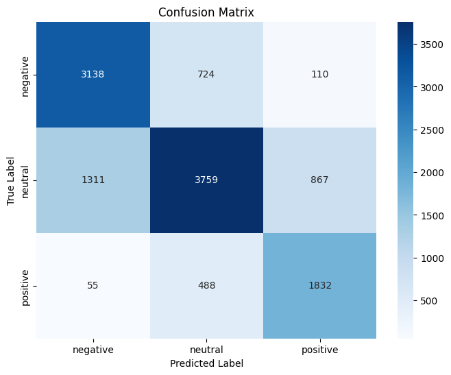
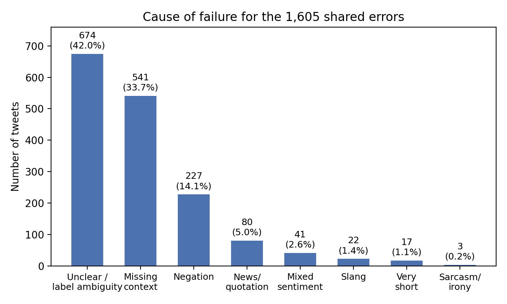
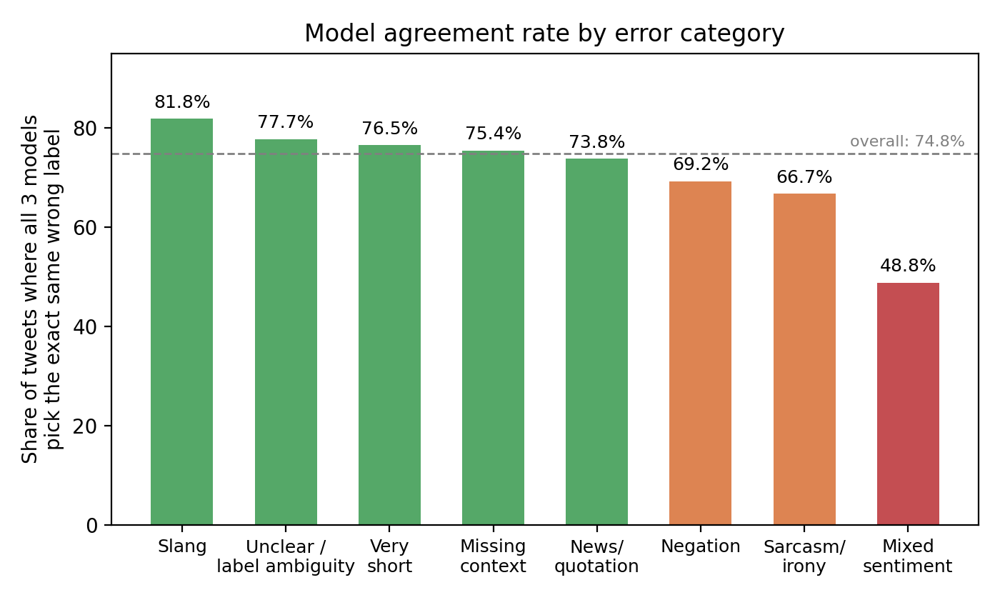

# Twitter Sentiment Classification with BERT / RoBERTa — A Parameter-Efficiency and Cross-Model Error Analysis Study

Three-way sentiment classification (negative / neutral / positive) on the **TweetEval** benchmark, comparing a classical TF-IDF + LinearSVC baseline against fine-tuned **BERT** and **RoBERTa**, then extending the study in two directions that are rarely examined together on this benchmark:

1. **Parameter efficiency** — full fine-tuning vs. **LoRA** (Low-Rank Adaptation) across four ranks `r ∈ {4, 8, 16, 32}`, measuring accuracy *and* trainable parameters *and* wall-clock training time.
2. **Cross-model error analysis** — isolating the 1,605 tweets that *every* architecture gets wrong, and attributing each one to a linguistic cause.

> **Headline findings.** LoRA matches or slightly beats full fine-tuning at every rank while updating as little as **0.59%** of RoBERTa's parameters and training up to **43% faster**. And the errors shared by all three models are driven overwhelmingly by **label ambiguity (42.0%)** and **missing context (33.7%)** — not by sarcasm (**0.2%**), the failure mode most often blamed in the literature.

Final project for **INS 3080 — Artificial Intelligence**, International School, Vietnam National University Hanoi (2026).

---

## Table of contents

- [Motivation](#motivation)
- [Dataset](#dataset)
- [Methodology](#methodology)
- [Results](#results)
- [Error analysis](#error-analysis)
- [Repository structure](#repository-structure)
- [Getting started](#getting-started)
- [Limitations](#limitations)
- [Team](#team)
- [References](#references)

---

## Motivation

Tweets are short, ungrammatical, and full of platform-specific conventions — hashtags, `@mentions`, emojis, links, deliberate misspellings. Bag-of-words models struggle because sentiment on Twitter often depends on word order, negation scope, and context that a lexical representation simply cannot see.

Transformers fix a lot of that. But two questions remain open on this benchmark:

- **Do you actually need to update all 125M parameters?** LoRA has been shown to match full fine-tuning on clean, edited text (GLUE-style benchmarks) — but not on short, noisy, informal Twitter text, which is exactly what TweetEval was built to stress-test.
- **What is actually left over?** Accuracy alone cannot tell you whether a mistake is a model weakness or an intrinsically impossible example. A recent meta-review of 38 systematic reviews found *sarcasm* to be the single most-cited challenge in sentiment analysis — but that consensus is rarely tested directly against the errors that a weak model, BERT, and RoBERTa all share.

This project tests both on the same benchmark, with the same splits, under the same training setup.

---

## Dataset

[TweetEval](https://github.com/cardiffnlp/tweeteval) sentiment subset, derived from SemEval-2017 Task 4. Loaded via `datasets`:

```python
from datasets import load_dataset
dataset = load_dataset("cardiffnlp/tweet_eval", "sentiment")
```

| Split | Tweets | Avg. words | Avg. chars |
|---|---:|---:|---:|
| Train | 45,615 | 19.2 | 108.0 |
| Validation | 2,000 | 19.4 | 108.6 |
| Test | 12,284 | 14.9 | 92.4 |

Labels: `0 = negative`, `1 = neutral`, `2 = positive`.

Two EDA findings that matter downstream:

- **Length is not a useful feature.** The length distributions of the three sentiment classes are nearly identical, so any signal has to come from meaning and context, not surface statistics.
- **There is a label-distribution shift between train and test.** Positive is ~39% of training but only ~19% of test. This is why **Macro-F1**, not loss, was used for checkpoint selection, and it explains part of the Neutral recall gap in the results below.

Duplicates were negligible (28 tweets, 0.06%, all in train), so no deduplication was applied.

---

## Methodology

### 1. Baseline — TF-IDF + LinearSVC

Unigram TF-IDF (L2-normalised, scikit-learn defaults) → `LinearSVC` with `max_iter=5000`, one-vs-rest over the three classes. The vectorizer is fit **only** on the training split and used to transform validation and test, avoiding leakage.

### 2. Fine-tuned BERT and RoBERTa

`bert-base-uncased` (110M) and `roberta-base` (125M), both fine-tuned end-to-end with `AutoModelForSequenceClassification`. They share architecture (12 layers, 12 heads) and objective, so any gap between them reflects **pretraining choices** — RoBERTa's dynamic masking, removal of Next Sentence Prediction, ~160GB vs 16GB of pretraining data, and a 50K byte-level BPE vocabulary vs BERT's 30K WordPiece.

Both were trained under an identical configuration to keep the comparison honest:

| Hyperparameter | Value |
|---|---|
| Max sequence length | 128 tokens |
| Learning rate | 2e-5, linear schedule |
| Batch size (train / eval) | 16 / 32 |
| Weight decay | 0.01 |
| Epochs (max) | 3 |
| Warmup ratio | 0.1 |
| Early stopping patience | 2 eval epochs |
| Checkpoint selection | Validation Macro-F1 |
| Seed | 42 |

### 3. LoRA fine-tuning

<p align="center">
  
</p>

LoRA freezes the pretrained backbone and learns a pair of low-rank matrices `A ∈ R^(768×r)` and `B ∈ R^(r×768)` injected into the **query** and **value** projections of all 12 self-attention layers — `36,864r` trainable parameters, plus the always-trainable 593K classification head.

Everything else in the pipeline is byte-for-byte identical to the full fine-tuning run — same tokenizer, same `Trainer` loop, same per-epoch validation, same `load_best_model_at_end` before predicting on the 12,284-tweet test set. **The only thing that changes is which parameters receive gradients**, so any difference in accuracy or training cost is attributable to the fine-tuning strategy alone.

### 4. Error analysis framework

<p align="center">
  
</p>

- **Stage 1 — shared error set.** Build one error set per model, align them on `(tweet text, gold label)`, and take the intersection `E_SVM ∩ E_BERT ∩ E_RoBERTa`. Restricting to this intersection removes model-specific noise: whatever survives is a property of the *task*, not of any one architecture.
- **Stage 2 — cause attribution.** Each shared error is passed through an ordered rule cascade of eight categories (sarcasm/irony → mixed sentiment → negation → news/quotation → missing context → slang → very short → catch-all). The cascade is exclusive and first-match-wins, so every tweet leaves with exactly one label and the shares sum to 100%.
- **Stage 3 — cross-model agreement.** For each category, compute the share of tweets where all three models predict the *exact same wrong label*. High agreement points to a single misleading surface cue or a debatable gold label; low agreement points to intrinsic ambiguity that each model resolves differently.

---

## Results

### Model comparison

| Model | Accuracy | Macro-F1 | Weighted-F1 |
|---|---:|---:|---:|
| TF-IDF + LinearSVC | 0.5667 | 0.55 | 0.57 |
| Fine-tuned BERT | 0.6760 | 0.6717 | 0.67 |
| Fine-tuned RoBERTa (full) | 0.7106 | 0.7122 | 0.71 |
| **RoBERTa + LoRA (r = 32)** | **0.7129** | **0.7129** | **0.71** |

Both Transformers clear the lexical baseline by a wide margin — RoBERTa by 14.4 accuracy points, BERT by 10.9 — which is what you would expect given that a bag-of-words representation has no notion of word order or negation scope.

### Full fine-tuning vs. LoRA

| Method | Trainable params | % of 124.6M | Train time (min) | Peak GPU (GB) | Accuracy | Macro-F1 |
|---|---:|---:|---:|---:|---:|---:|
| Full fine-tune | 124,647,939 | 100% | 22.2 | 3.64 | 0.7106 | 0.7122 |
| LoRA `r=4` | 740,355 | 0.590% | 14.5 | 3.95 | 0.7115 | 0.7119 |
| LoRA `r=8` | 887,811 | 0.707% | 13.1 | 3.95 | 0.7123 | 0.7124 |
| LoRA `r=16` | 1,182,723 | 0.940% | 12.6 | 3.96 | 0.7125 | 0.7128 |
| **LoRA `r=32`** | 1,772,547 | 1.402% | **12.6** | 3.97 | **0.7129** | **0.7129** |

Three things worth pulling out:

**LoRA's efficiency gain costs essentially nothing in accuracy.** Every rank tested matches or marginally exceeds full fine-tuning on both metrics, while cutting wall-clock training time by 35–43%. Full-parameter updates are not required to reach this benchmark's performance ceiling — a low-rank adaptation captures nearly all of the task-relevant signal and leaves the vast majority of pretrained weights untouched.

**Performance saturates early.** Going from `r=4` to `r=32` buys only +0.001 Macro-F1 despite a 2.4× increase in trainable parameters. A small rank (`r=8`) already captures nearly everything available — useful if you are deploying under a tight compute or storage budget.

**Peak GPU memory is nearly flat (~4 GB) across all configurations.** The frozen backbone still dominates memory regardless of how few parameters are trainable; LoRA's savings live in optimizer state and gradient memory, which are small relative to model weights at this scale and so do not show up clearly at `r ≤ 32`.

### Where the models fail

<p align="center">
  
</p>

BERT and RoBERTa both post their **lowest recall on Neutral** (0.684 and 0.633), confusing genuinely neutral tweets — factual statements, headlines — with either polarity. The SVM has the opposite problem: its weakest class is Positive, driven by low *precision* (0.46), because it over-predicts Positive from strong lexical cues like "great" and "love" regardless of context. The Neutral recall gap on the Transformer side is consistent with the train/test class-distribution shift noted above.

---

## Error analysis

Intersecting the three error sets isolates **1,605 tweets (13.07% of the test set)** that no architecture classifies correctly.

<p align="center">
  
</p>

| Category | Count | Share |
|---|---:|---:|
| Unclear / label ambiguity | 674 | 42.0% |
| Missing context | 541 | 33.7% |
| Negation | 227 | 14.1% |
| News / quotation | 80 | 5.0% |
| Mixed sentiment | 41 | 2.6% |
| Slang | 22 | 1.4% |
| Very short | 17 | 1.1% |
| **Sarcasm / irony** | **3** | **0.2%** |

**Shared errors are not driven by sarcasm.** If sarcasm were the real bottleneck it should dominate this intersection. Instead it accounts for 0.2%, while label ambiguity and missing context together explain roughly three quarters of every shared failure. This suggests self-attention already handles sarcasm reasonably well, and that the field's emphasis on it may reflect the difficulty it posed to *older lexicon-based methods* more than to Transformers. The real bottleneck here is the data itself — a tweet whose sentiment lives inside a linked article, or whose gold label is genuinely debatable, is unreachable by architecture or optimisation alone.

<p align="center">
  
</p>

Across all 1,605 shared errors, the three models converge on the **exact same wrong label 74.8% of the time** — further evidence that these errors are properties of the data rather than of any model's individual bias. Mixed sentiment shows the lowest agreement (48.8%, i.e. genuinely ambiguous, each model resolves it differently), while slang (81.8%) and unclear cases (77.7%) show the highest (i.e. one misleading surface cue or one debatable gold label steering all three identically).

The full annotated error set is in [`results/common_errors_all_three_models.csv`](results/common_errors_all_three_models.csv).

---

## Repository structure

```
.
├── notebooks/
│   ├── final_twitter_code.ipynb    # EDA → preprocessing → SVM/BERT/RoBERTa → LoRA sweep → error analysis
│   └── demo_tweet_final.ipynb      # Gradio demo: type a tweet, get predictions from all models
├── report/
│   └── Twitter_Sentiment_BERT_RoBERTa_LoRA_Report.pdf
├── results/
│   ├── lora_vs_full_comparison.csv        # params / time / memory / accuracy per method
│   ├── common_errors_all_three_models.csv # the 1,605 shared errors + each model's prediction
│   └── meta.json                          # metrics summary consumed by the demo
├── models/
│   ├── baseline-svm/               # fitted TF-IDF vectorizer + LinearSVC (joblib)
│   └── roberta-lora-r32/           # LoRA adapter (7 MB) + tokenizer — see models/README.md
├── figures/
└── requirements.txt
```

> **Note on model weights.** The LoRA adapter is only 7 MB and is committed here. The **full fine-tuned RoBERTa checkpoint (~500 MB) is not** — it exceeds GitHub's 100 MB per-file limit. See [`models/README.md`](models/README.md) for how to reproduce it or host it on the Hugging Face Hub.

---

## Getting started

### Run the notebooks

Both notebooks were written for **Google Colab with a GPU runtime** (T4 is enough). The simplest path:

1. Open [Google Colab](https://colab.research.google.com/) → `File` → `Open notebook` → `GitHub` tab → paste this repo URL.
2. Pick `notebooks/final_twitter_code.ipynb`.
3. `Runtime` → `Change runtime type` → `T4 GPU`.
4. Run all cells. The full pipeline (baseline + BERT + RoBERTa + 4 LoRA ranks) takes roughly 1.5–2 hours.

### Run locally

```bash
git clone https://github.com/nynyann/twitter-sentiment-bert-roberta-lora.git
cd twitter-sentiment-bert-roberta-lora
python -m venv .venv && source .venv/bin/activate   # Windows: .venv\Scripts\activate
pip install -r requirements.txt
jupyter notebook
```

### Use the LoRA adapter

```python
from transformers import AutoTokenizer, AutoModelForSequenceClassification
from peft import PeftModel

base = AutoModelForSequenceClassification.from_pretrained("roberta-base", num_labels=3)
model = PeftModel.from_pretrained(base, "models/roberta-lora-r32")
model.eval()

tokenizer = AutoTokenizer.from_pretrained("models/roberta-lora-r32")

labels = ["negative", "neutral", "positive"]
inputs = tokenizer("this is honestly the best day I've had all year", return_tensors="pt", truncation=True, max_length=128)
print(labels[model(**inputs).logits.argmax(-1).item()])
```

### Use the baseline

```python
import joblib

vectorizer = joblib.load("models/baseline-svm/tfidf_vectorizer.joblib")
svm = joblib.load("models/baseline-svm/svm_linearsvc.joblib")
print(svm.predict(vectorizer.transform(["what a terrible morning"])))
```

---

## Limitations

Worth being upfront about these:

- **Cause attribution is heuristic, not annotated.** The eight categories come from keyword lists and regular expressions, not verified human labels. The first-match-wins cascade also credits a multi-cause tweet to a single category. The counts should be read as an approximate map, not ground truth.
- **The catch-all category is large.** 42% of shared errors land in "unclear / label ambiguity" precisely because no rule fired. Manually annotating a sample of that bucket would separate genuine label noise from patterns the cascade does not test for.
- **Adapter placement is narrow.** LoRA was applied only to the query and value projections. Whether a wider placement closes the small residual gap on negation-heavy cases is untested.
- **Twitter-specific encoders were not evaluated.** `bertweet` or `twitter-roberta-base` would be the natural next comparison.

---

## Team

| Member | Student ID | Contribution |
|---|---|---|
| Ngo Thi Kim Ngan | 23071029 | RoBERTa fine-tuning + LoRA integration; model comparison; Introduction & Discussion |
| Tong Khanh Ly | 23071036 | BERT fine-tuning; error analysis; Conclusion |
| Nguyen Quang Minh | 23071039 | Preprocessing pipelines; TF-IDF + LinearSVC baseline |
| Nguyen Ngoc Anh | 23071077 | Dataset loading; exploratory data analysis; Literature Review |

Supervisor: Dr. Nguyen Viet Hung — INS 3080, International School, VNU Hanoi.

---

## References

1. Barbieri, F., Camacho-Collados, J., Neves, L., & Espinosa-Anke, L. (2020). *TweetEval: Unified Benchmark and Comparative Evaluation for Tweet Classification.* [arXiv:2010.12421](https://arxiv.org/abs/2010.12421)
2. Rosenthal, S., Farra, N., & Nakov, P. (2017). *SemEval-2017 Task 4: Sentiment Analysis in Twitter.* [ACL Anthology](https://aclanthology.org/S17-2088/)
3. Hu, E. J., Shen, Y., Wallis, P., Allen-Zhu, Z., Li, Y., Wang, S., Wang, L., & Chen, W. (2021). *LoRA: Low-Rank Adaptation of Large Language Models.* [arXiv:2106.09685](https://arxiv.org/abs/2106.09685)
4. Vaswani, A., et al. (2017). *Attention Is All You Need.* [arXiv:1706.03762](https://arxiv.org/abs/1706.03762)
5. Devlin, J., Chang, M.-W., Lee, K., & Toutanova, K. (2019). *BERT: Pre-training of Deep Bidirectional Transformers for Language Understanding.* [arXiv:1810.04805](https://arxiv.org/abs/1810.04805)
6. Liu, Y., et al. (2019). *RoBERTa: A Robustly Optimized BERT Pretraining Approach.* [arXiv:1907.11692](https://arxiv.org/abs/1907.11692)
7. Ayravainen, L. E. M., Hinds, J., & Davidson, B. I. (2023). *Sentiment Analysis in Digital Spaces: An Overview of Reviews.* [arXiv:2310.19687](https://arxiv.org/abs/2310.19687)
8. Pang, B., & Lee, L. (2008). *Opinion Mining and Sentiment Analysis.* Foundations and Trends in Information Retrieval, 2(1–2), 1–135.

---

## License

Released under the [MIT License](LICENSE). The TweetEval dataset is redistributed by its original authors under their own terms.
